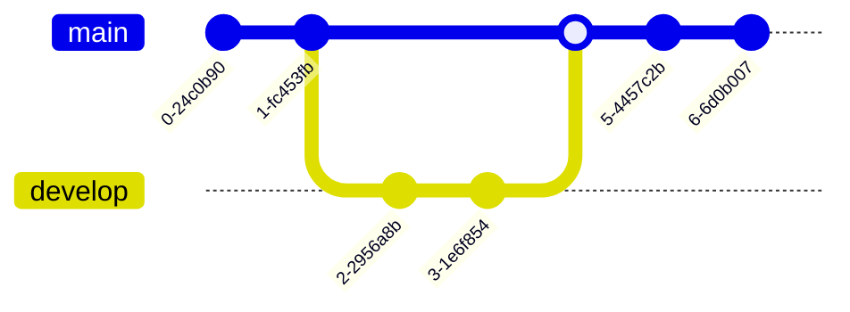

The main purpose of this article is to make sure that all basic HTML Elements are decorated with CSS so as to not miss any possible elements when creating new themes for Hugo.
<!--more-->

## Headings

Let's start with all possible headings. The HTML `<h1>`—`<h6>` elements represent six levels of section headings. `<h1>` is the highest section level and `<h6>` is the lowest.

# Heading 1
## Heading 2
### Heading 3
#### Heading 4
##### Heading 5
###### Heading 6

***

## Paragraph

According to the [HTML5 specification](https://www.w3.org/TR/html5/dom.html#elements) by [W3C](https://www.w3.org/), **HTML documents consist of a tree of elements and text**. Each element is denoted in the source by a [start tag](https://www.w3.org/TR/html5/syntax.html#syntax-start-tags), such as `<body>`, and an [end tag](https://www.w3.org/TR/html5/syntax.html#syntax-end-tags), such as `</body>`. (*Certain start tags and end tags can in certain cases be omitted and are implied by other tags.*)

Elements can have attributes, which control how the elements work. For example, hyperlink are formed using the `a` element and its `href` attribute.

## List Types

### Ordered List

1. First item
2. Second item
3. Third item

### Unordered List

* List item
* Another item
* And another item

### Nested list

<ul>
  <li>First item</li>
  <li>Second item
    <ul>
      <li>Second item First subitem</li>
      <li>Second item second subitem
        <ul>
          <li>Second item Second subitem First sub-subitem</li>
          <li>Second item Second subitem Second sub-subitem</li>
          <li>Second item Second subitem Third sub-subitem</li>
        </ul>
      </li>
      <li>Second item Third subitem
        <ol>
          <li>Second item Third subitem First sub-subitem</li>
          <li>Second item Third subitem Second sub-subitem</li>
          <li>Second item Third subitem Third sub-subitem</li>
        </ol>
    </ul>
  </li>
  <li>Third item</li>
</ul>

### Definition List

HTML also supports definition lists.

<dl>
  <dt>Blanco tequila</dt>
  <dd>The purest form of the blue agave spirit...</dd>
  <dt>Reposado tequila</dt>
  <dd>Typically aged in wooden barrels for between two and eleven months...</dd>
</dl>

## Blockquotes

The blockquote element represents content that is quoted from another source, optionally with a citation which must be within a `footer` or `cite` element, and optionally with in-line changes such as annotations and abbreviations.

> Quoted text.
> This line is part of the same quote.
> Also you can *put* **Markdown** into a blockquote.

Blockquote with a citation.

<blockquote>
  <p>My goal wasn't to make a ton of money. It was to build good computers. I only started the company when I realized I could be an engineer forever.</p>
  <footer>— <cite>Steve Wozniak</cite></footer>
</blockquote>

According to Mozilla's website, <q cite="https://www.mozilla.org/en-US/about/history/details/">Firefox 1.0 was released in 2004 and became a big success.</q>

## Tables

Tables aren't part of the core Markdown spec, but Hugo supports them.

| ID  | Make      | Model   | Year |
| --- | --------- | ------- | ---- |
| 1   | Honda     | Accord  | 2009 |
| 2   | Toyota    | Camry   | 2012 |
| 3   | Hyundai   | Elantra | 2010 |

Colons can be used to align columns.

| Tables      | Are           | Cool         |
|:----------- |:-------------:| ------------:|
| align: left | align: center | align: right |
| align: left | align: center | align: right |
| align: left | align: center | align: right |

You can also use inline Markdown.

| Inline     | Markdown  | In                | Table      |
| ---------- | --------- | ----------------- | ---------- |
| *italics*  | **bold**  | ~~strikethrough~~ | `code`     |

## Code

```html
<!DOCTYPE html>
<html lang="en">
<head>
  <meta charset="UTF-8">
  <title>Example HTML5 Document</title>
</head>
<body>
  <p>Test</p>
</body>
</html>
```


<!DOCTYPE html>
<html lang="en">
<head>
  <meta charset="UTF-8">
  <title>Example HTML5 Document</title>
</head>
<body>
  <p>Test</p>
</body>
</html>


## Other stuff — abbr, sub, sup, kbd, etc.

<abbr title="Graphics Interchange Format">GIF</abbr> is a bitmap image format.

H<sub>2</sub>O

C<sub>6</sub>H<sub>12</sub>O<sub>6</sub>

X<sup>n</sup> + Y<sup>n</sup> = Z<sup>n</sup>

Press <kbd>X</kbd> to win. Or press <kbd><kbd>CTRL</kbd>+<kbd>ALT</kbd>+<kbd>F</kbd></kbd> to show FPS counter.

<mark>As a unit of information in information theory, the bit has alternatively been called a shannon</mark>, named after Claude Shannon, the founder of field of information theory.

## Mermaid 

The following are some examples of the diagrams, charts and graphs that can be made using Mermaid. Click here to jump into the [text syntax](https://mermaid.js.org/intro/syntax-reference.html).

### Flowchart 

[docs](https://mermaid.js.org/syntax/flowchart.html) - [live editor](https://mermaid.live/edit#pako:eNpNkMtqwzAQRX9FzKqFJK7t1km8KDQP6KJQSLOLvZhIY1tgS0GWmgbb_165IaFaiXvOFTPqgGtBkEJR6zOv0Fj2scsU8-ft8I5G5Gw6fe339GN7tnrYaafE45WvRsLW3Ya4bKVWwzVe_xU-FfVsc9hR62rLwvw_2591z7Y3FuUwgYZMg1L4ObrRzMBW1FAGqb8KKtCLGWRq8Ko7CbS0FdJqA2mBdUsTQGf110VxSK1xdJM2EkuDzd2qNQrypQ7s5TQuXcrW-ie5VoUsx9yZ2seVtac2DYIRz0ppK3eccd0ErRTjD1XfyyRIomSBUUzJPMaXOBb8GC4XRfQcFmL-FEYIwzD8AggvcHE)

```
flowchart LR

A[Hard] -->|Text| B(Round)
B --> C{Decision}
C -->|One| D[Result 1]
C -->|Two| E[Result 2]
```


### Sequence diagram 

[docs](https://mermaid.js.org/syntax/sequenceDiagram.html) - [live editor](https://mermaid.live/edit#pako:eNo9kMluwjAQhl_F-AykQMuSA1WrbuLQQ3v1ZbAnsVXHkzrjVhHi3etQwKfRv4w-z0FqMihL2eF3wqDxyUEdoVHhwTuNk-12RzaU4g29JzHMY2HpV0BE0VO6V8ETtdkGz1Zb1F8qiPyG5LX84mrLAmpwoWNh-5a0pWCiAxUwGBXeiVHEU4oq8V_6AHYUwAu2lLLTjVQ4bc1rT2yleI0IfJG320faZ9ABbk-Jz3hZnFxBduR9L2oiM5Jj2WBswJn8-cMArSRbbFDJMo8GK0ielVThmKOpNcD4bBxTlGUFvsOxhMT02QctS44JL6HzAS-iJzCYOwfJfTscunYd542aQuXqQU_RZ9kyt11ZFIM9rR3btJ9qaorOGQuR7c9mWSznyzXMF7hcLeBusTB6P9usq_ntrDKrm9kc5PF4_AMJE56Z)

```
sequenceDiagram
Alice->>John: Hello John, how are you?
loop HealthCheck
    John->>John: Fight against hypochondria
end
Note right of John: Rational thoughts!
John-->>Alice: Great!
John->>Bob: How about you?
Bob-->>John: Jolly good!
```


### Gantt chart 

[docs](https://mermaid.js.org/syntax/gantt.html) - [live editor](https://mermaid.live/edit#pako:eNp90cGOgyAQBuBXIZxtFbG29bbZ3fsmvXKZylhJEAyOTZrGd1_sto3xsHMBhu-HBO689hp5xS_giJQbsCbjHTv9jcp9-q63SKhZpb3DhMXSOIiE5ZkoNpnYZGXynh6U-4jBK7JnVfBYJo9QvgjtEya1cj8QwFq0TMz4lZqxTBg0hOF5m1jifI2Lf7Bc490CyxUu1rhc4GLGPOEdhg6Mjq92V44xxanFDhWv4lRjA6MlxZWbIh17DYTf2pAPvGrADphwGMmfbq7mFYURX-jLwCVA91bWg8YYunO69Y8vMgPFI2vvGnOZ-2Owsd0S9UOVpvP29mKoHc_b2nfpYHQLgdrrsUzLvDxALrHcS9hJqeuzOB6avBCN3mciBz5N0y_wxZ0J)

```
gantt
    section Section
    Completed :done,    des1, 2014-01-06,2014-01-08
    Active        :active,  des2, 2014-01-07, 3d
    Parallel 1   :         des3, after des1, 1d
    Parallel 2   :         des4, after des1, 1d
    Parallel 3   :         des5, after des3, 1d
    Parallel 4   :         des6, after des4, 1d
```


### Class diagram 

```
classDiagram
Class01 <|-- AveryLongClass : Cool
<<Interface>> Class01
Class09 --> C2 : Where am I?
Class09 --* C3
Class09 --|> Class07
Class07 : equals()
Class07 : Object[] elementData
Class01 : size()
Class01 : int chimp
Class01 : int gorilla
class Class10 {
  <<service>>
  int id
  size()
}

```


### State diagram 

```
stateDiagram-v2
[*] --> Still
Still --> [*]
Still --> Moving
Moving --> Still
Moving --> Crash
Crash --> [*]
```


### Pie chart 

```
pie
"Dogs" : 386
"Cats" : 85.9
"Rats" : 15
```


### Git graph

```
gitGraph
  commit
  commit
  branch develop
  checkout develop
  commit
  commit
  checkout main
  merge develop
  commit
  commit
```



### Bar chart (using gantt chart) 

```
gantt
    title Git Issues - days since last update
    dateFormat  X
    axisFormat %s

    section Issue19062
    71   : 0, 71
    section Issue19401
    36   : 0, 36
    section Issue193
    34   : 0, 34
    section Issue7441
    9    : 0, 9
    section Issue1300
    5    : 0, 5
```


### User Journey diagram 

```
  journey
    title My working day
    section Go to work
      Make tea: 5: Me
      Go upstairs: 3: Me
      Do work: 1: Me, Cat
    section Go home
      Go downstairs: 5: Me
      Sit down: 3: Me
```


### C4 diagram 

```
C4Context
title System Context diagram for Internet Banking System

Person(customerA, "Banking Customer A", "A customer of the bank, with personal bank accounts.")
Person(customerB, "Banking Customer B")
Person_Ext(customerC, "Banking Customer C")
System(SystemAA, "Internet Banking System", "Allows customers to view information about their bank accounts, and make payments.")

Person(customerD, "Banking Customer D", "A customer of the bank, <br/> with personal bank accounts.")

Enterprise_Boundary(b1, "BankBoundary") {

  SystemDb_Ext(SystemE, "Mainframe Banking System", "Stores all of the core banking information about customers, accounts, transactions, etc.")

  System_Boundary(b2, "BankBoundary2") {
    System(SystemA, "Banking System A")
    System(SystemB, "Banking System B", "A system of the bank, with personal bank accounts.")
  }

  System_Ext(SystemC, "E-mail system", "The internal Microsoft Exchange e-mail system.")
  SystemDb(SystemD, "Banking System D Database", "A system of the bank, with personal bank accounts.")

  Boundary(b3, "BankBoundary3", "boundary") {
    SystemQueue(SystemF, "Banking System F Queue", "A system of the bank, with personal bank accounts.")
    SystemQueue_Ext(SystemG, "Banking System G Queue", "A system of the bank, with personal bank accounts.")
  }
}

BiRel(customerA, SystemAA, "Uses")
BiRel(SystemAA, SystemE, "Uses")
Rel(SystemAA, SystemC, "Sends e-mails", "SMTP")
Rel(SystemC, customerA, "Sends e-mails to")
```


